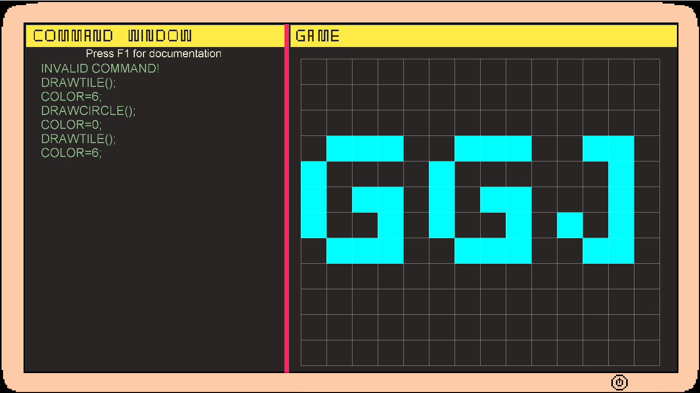
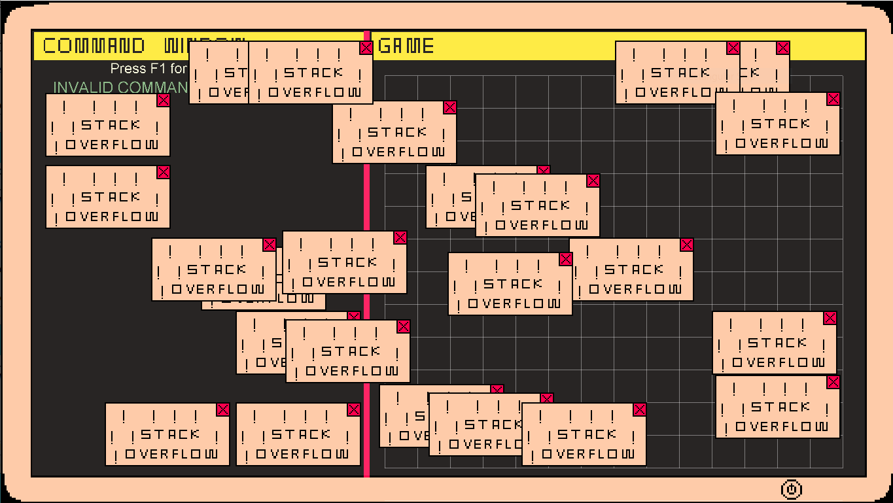
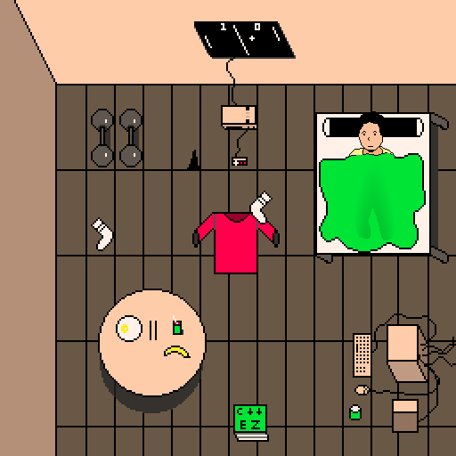

# GameDev Simulator

Our Entry to the Global Game Jam 2021 with theme: Lost and Found. The Game is Made in 48 hours using our custom 2D game engine.

## Decription

A day in the life of Ahmed Hatem, who is a game developer working on a company named "From Newbies" using their engine "Our Engine Socks", you get to experience the struggles a game developer might face. In the journey, he faces a lot of frustration that make him question himself, is he wasting time? will his efforts go in vain?

## Video Trailer
https://www.youtube.com/watch?v=7G9QHjy9pCU

## Screenshots

### Play

### Bugs

### Late Night Overthinking

## Installation
Currently supports Windows only
* Just install Monogame Framework

## How To Run
There are few options to run the game:
* Build and run solution 
* Run from executable directly(double-click) from the path: GGJ_2021\bin\Windows\x86\Debug\GGJ_2021.exe
* Download and play directly from: https://ossyahya60.itch.io/gamedev-simulator

## Credits

* "nosoapradio" For using his awesome soundtrack

